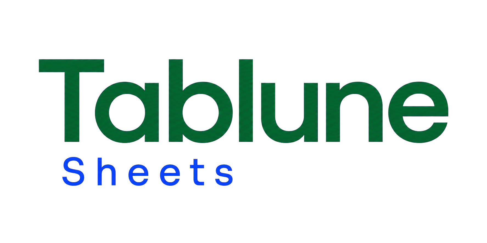

<p align="center">
  
  
</p>

# Tablune Sheets

Tablune Sheets is a desktop CSV editor and a Python-powered spreadsheet for local data projects, built with Rust, Tauri, React, and TypeScript.

The initial release targets macOS for development and validation, while preserving a cross-platform architecture for Windows 11.

## Current scope (0.5)

- Write cell formulas such as `=B1 + C1` in project sheets and recalculate affected cells automatically
- Use relative/absolute references, ranges, Python expressions, and project-defined functions
- Edit the original formula in a formula bar while the grid shows its result
- Apply cell types, copy formulas with adjusted references, paste values, and undo structural changes
- Save formulas, original text, function drafts/applied code, and cached results in format-2 projects
- Enable Python explicitly for each project session before any calculation runs

- Start from Home with recent files and multiple open workspaces
- Create, save, and reopen self-contained `.tablune` projects
- Keep editable tables, Python scripts, column settings, and views together
- Reuse a Python script with another input table and create independent result tables
- Import CSV data into a project or create a project from an edited CSV
- Create a new CSV document
- Open and inspect UTF-8 CSV, TSV, and semicolon-delimited files
- Edit cell values in a virtualized canvas grid
- Insert and delete rows and columns
- Copy, cut, and paste tabular data
- Undo and redo edits
- Save and Save As without silently coercing textual values
- Detect and retain the delimiter and line-ending convention when practical
- Find and replace values with document, range, and cell scopes
- Suggest and persist a non-destructive header row
- Protect unsaved work and restore a recovery snapshot after an unexpected exit
- Sort and filter without mutating the source document
- Explore facets, inferred column types, and column quality profiles
- Export the current view or explicitly apply a sort to the document

Project tables are calculable sheets. Cross-sheet references, multi-cell formula outputs, Excel formula compatibility, cell formatting, XLSX, pipelines, external linked sources, and out-of-memory processing remain outside this release.

## Architecture

- `apps/desktop`: Tauri desktop shell and React user interface
- `crates/tablune-core`: in-memory table model and edit operations
- `crates/tablune-csv`: CSV parsing, dialect detection, and serialization
- `crates/tablune-history`: reusable undo and redo history
- `docs`: product scope and technical decisions

## Prerequisites

- Rust stable toolchain
- Node.js 22 or newer
- pnpm
- macOS: Xcode Command Line Tools
- Windows 11: Microsoft C++ Build Tools and WebView2

## Run on macOS

```bash
xcode-select --install
corepack enable
pnpm install
pnpm dev
```

## Quality checks

```bash
pnpm check
pnpm --dir apps/desktop test
cargo test --workspace
cargo clippy --workspace --all-targets -- -D warnings
```

## Current milestone

Tablune 0.5 adds Python calculation inside existing project sheets. Rust owns original cell content, dependency analysis, revisions, history, and persistence; a reusable Python child evaluates validated expressions and user functions. Grid rendering remains windowed. CSV files remain textual documents; saved files normalize quoting into valid CSV using the detected dialect.

## Working with projects

Choose **New project** on Home, import CSV tables, and create or import a Python script. In the central script editor, choose an input table, run a preview, and select **Create result table**. Each accepted execution adds an editable copy; it never overwrites the input or a previous result. Saving a project stores all its tables and scripts in one `.tablune` file. Reopen it later and select a different table to reuse the script.

CSV workspaces retain their existing macro panel and save behavior. **Create project from this CSV** copies the current in-memory data and view, including unsaved edits, while leaving the original CSV open. Exporting a table produces a CSV and does not save the project.

## Python in cells

In a project sheet, enter `10` in B1, `20` in C1, and `=B1 + C1` in A1. Choose **Enable Python** to calculate: A1 displays `30`, retains its formula, and updates when B1 or C1 changes. Imported headers remain visible in row 1; all project columns use A, B, C addresses.

Open **Functions**, define a function, and choose **Apply functions**:

```python
def precio_final(base, impuesto):
    return round(base * (1 + impuesto), 2)
```

Use it in a cell as `=precio_final(B2, C2)`. Editing the module saves a draft; only a successful explicit application changes the active functions. `=sum(cells("B2:B10"))` reads a row-major range. Empty cells become `None`, and `00123` remains text. An initial apostrophe forces literal text.

Python 3.10+ and any imported packages must already be installed in the user-selected environment. Projects contain source code, not Python installations or dependencies. Opening a project shows cached results as pending and never executes Python; enable it again for that session. User functions run with normal interpreter permissions, and the separate process is not a security sandbox. Exporting or transforming a sheet requires current results without formula errors. See [project and formula behavior](docs/projects.md) and [validation](docs/validation-0.5.md).
